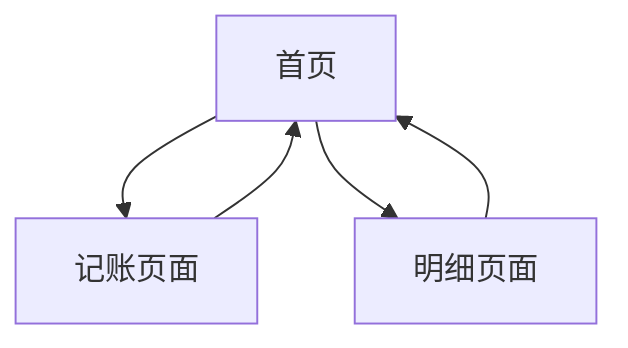

## 1. 产品概述
简洁的个人记账应用，帮助用户快速记录收支，查看财务概况。通过直观的界面设计，让用户轻松管理日常财务，培养良好的记账习惯。

## 2. 核心功能

### 2.2 功能模块
记账应用包含以下核心页面：
1. **首页**：侧边菜单、财务摘要卡片、记账按钮
2. **记账页面**：收支记录、分类选择、金额输入
3. **明细页面**：收支列表、筛选功能

### 2.3 页面详情
| 页面名称 | 模块名称 | 功能描述 |
|---------|---------|----------|
| 首页 | 头部导航 | 显示更多按钮，点击后从左至右滑出侧边菜单，占据屏幕4/5宽度 |
| 首页 | 财务摘要卡片 | 显示当前年月、总收入、总支出、结余金额 |
| 首页 | 记账按钮 | 通栏按钮，点击后跳转到记账页面 |
| 记账页 | 收支记录 | 选择收入/支出类型，输入金额和备注 |
| 记账页 | 分类选择 | 提供常用收支分类选项 |
| 明细页 | 收支列表 | 按时间倒序显示所有记账记录 |
| 明细页 | 筛选功能 | 按日期、类型、分类筛选记录 |

## 3. 核心流程
用户打开应用后，首先看到首页的财务摘要信息。点击"记一笔"按钮进入记账页面，选择收支类型、分类，输入金额后保存。用户可以通过侧边菜单快速导航到明细页面查看历史记录。

## 4. 用户界面设计

### 4.1 设计风格
- 主色调：绿色（代表财富增长）
- 按钮样式：圆角矩形，扁平化设计
- 字体：系统默认字体，重要数字使用较大字号
- 布局风格：卡片式布局，清晰分区
- 图标风格：简洁线性图标

### 4.2 页面设计概览
| 页面名称 | 模块名称 | UI元素 |
|---------|---------|---------|
| 首页 | 头部导航 | 左侧更多按钮（三条横线图标），点击后滑出侧边菜单，菜单背景为白色，包含导航选项 |
| 首页 | 财务摘要卡片 | 圆角卡片，背景为渐变色，显示年月（大字体）、总收入（绿色）、总支出（红色）、结余（蓝色） |
| 首页 | 记账按钮 | 通栏按钮，绿色背景，白色文字"记一笔"，底部固定位置 |

### 4.3 响应式设计
采用移动端优先设计，适配各种屏幕尺寸。侧边菜单在移动设备上滑出效果流畅，在桌面端可固定显示。触摸交互优化，按钮点击区域足够大。