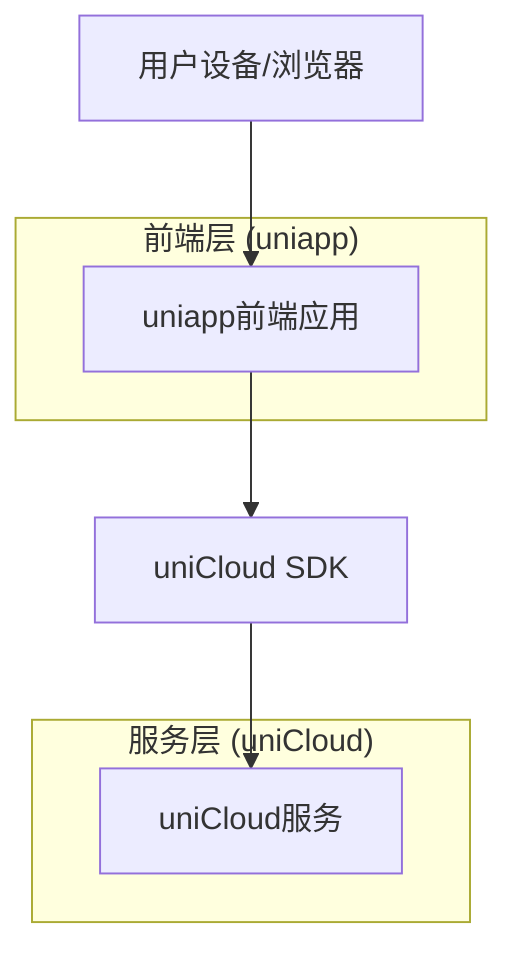

## 1. 架构设计



## 2. 技术描述
- 前端：uniapp (Vue 3 + Vite)
- 开发工具：HBuilderX / VS Code
- 后端：uniCloud (云函数、云数据库、云存储)
- 运行平台：Android App, H5/Web

## 3. 页面定义
| 页面路径 | 用途 |
|-------|---------|
| pages/index/index | 首页，显示财务摘要和记账入口 |
| pages/record/record | 记账页面，添加收支记录 |
| pages/detail/detail | 明细页面，查看历史记录 |

## 4. 云函数定义

### 4.1 核心云函数

记账记录管理 (record-manager)
```javascript
// 云函数：record-manager
// 处理增删改查
```

请求参数示例：
| 参数名 | 参数类型 | 是否必需 | 描述 |
|-----------|-------------|-------------|-------------|
| action | string | 是 | 操作类型 (add/get/delete) |
| data | object | 是 | 记录数据 |

## 5. 数据模型

### 5.1 数据模型定义 (uniCloud DB Schema)
```json
{
  "bsonType": "object",
  "required": ["type", "amount", "category", "record_date"],
  "permission": {
    "read": "auth.uid == doc.user_id",
    "create": "auth.uid != null",
    "update": "auth.uid == doc.user_id",
    "delete": "auth.uid == doc.user_id"
  },
  "properties": {
    "_id": {
      "description": "存储 ID"
    },
    "user_id": {
      "bsonType": "string",
      "foreignKey": "uni-id-users._id",
      "description": "用户 ID"
    },
    "type": {
      "bsonType": "string",
      "enum": ["income", "expense"],
      "description": "收支类型"
    },
    "amount": {
      "bsonType": "double",
      "description": "金额"
    },
    "category": {
      "bsonType": "string",
      "description": "分类"
    },
    "note": {
      "bsonType": "string",
      "description": "备注"
    },
    "record_date": {
      "bsonType": "timestamp",
      "description": "记录日期"
    },
    "create_date": {
      "bsonType": "timestamp",
      "defaultValue": {
        "$env": "now"
      }
    }
  }
}
```